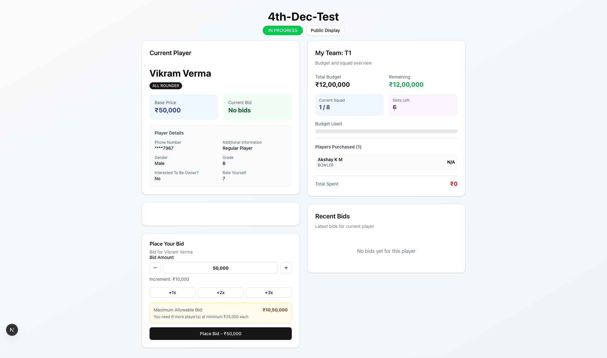
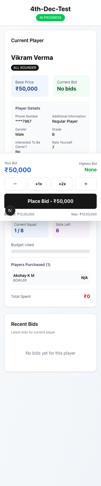
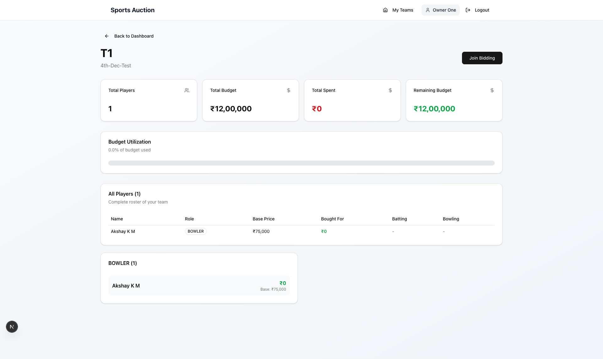

# Cricket Auction Platform - Team Owner User Manual

**Version 1.0**
*Complete Guide for Team Owners*

---

## Table of Contents
1. [Getting Started](#getting-started)
2. [Team Owner Dashboard](#team-owner-dashboard)
3. [Joining a Live Auction](#joining-a-live-auction)
4. [How to Place Bids](#how-to-place-bids)
5. [Understanding Budget Rules](#understanding-budget-rules)
6. [Viewing Your Team](#viewing-your-team)
7. [Tips for Successful Bidding](#tips-for-successful-bidding)
8. [Troubleshooting](#troubleshooting)

---

## Getting Started

### 1. Accessing the Platform

**Login Credentials:**
- You will receive your login email and password from the auction administrator
- Visit the auction website URL provided to you
- Click on "Sign In" or navigate to the sign-in page


*Figure 1: Login page - Enter your email and password to access the platform*

**First-Time Login:**
1. Enter your email address
2. Enter your password
3. Click "Sign In"
4. You will be automatically redirected to your Team Owner Dashboard

---

## Team Owner Dashboard

### Understanding Your Dashboard

When you first log in, you'll see your dashboard with:


*Figure 2: Team Owner Dashboard showing overview cards and team information*

**Overview Cards:**
- **Total Teams**: Number of teams assigned to you
- **Total Players**: Total players purchased across all teams
- **Total Spent**: Amount spent across all your teams
- **Remaining Budget**: Total budget remaining across all teams

**Team Cards:**
Each team you own will be displayed as a card showing:
- Team name and auction name
- Auction status badge (NOT STARTED, IN PROGRESS, PAUSED, COMPLETED)
- Number of players purchased
- Amount spent
- Budget progress bar (color-coded: green = healthy, yellow = medium, red = low)
- Action buttons:
  - **View Roster**: See all players in your team
  - **Join Bidding**: Available when auction is live

### Auction Status Indicators

| Status | Badge Color | Meaning |
|--------|-------------|---------|
| **NOT STARTED** | Gray | Auction hasn't begun yet |
| **IN PROGRESS** | Green (Pulsing "LIVE") | Auction is currently active - you can bid now! |
| **PAUSED** | Yellow | Auction is temporarily paused by admin |
| **COMPLETED** | Blue | Auction has finished |

---

## Joining a Live Auction

### When Auction is Active

1. **From Dashboard:**
   - Look for the "Active Auctions" tab on your dashboard
   - You'll see teams with a green "LIVE" badge
   - Click the **"Join Bidding Now"** button

2. **What You'll See:**
   - Current player being auctioned
   - Player details (name, role, base price)
   - Real-time bidding interface
   - Your team's budget and squad information
   - Recent bids from all teams

---

## How to Place Bids

### Desktop Bidding Interface


*Figure 3: Desktop bidding interface with player information and bid controls*

The bidding screen is divided into two main sections:

#### Left Section - Current Player Information
- **Player Details**: Name, role, and base price
- **Current Bid**: Highest bid amount
- **Highest Bidder**: Team name currently leading
- **Player Stats**: Additional information like batting/bowling style
- **Countdown Timer**: Time remaining for current player (if enabled)

#### Right Section - Your Team & Bidding
- **My Team**: Budget overview and squad composition
- **Bid Amount Controls**:
  - **(-) Button**: Decrease bid by one increment
  - **Bid Amount Field**: Shows your current bid (editable)
  - **(+) Button**: Increase bid by one increment
  - **Quick Bid Buttons**: +1x, +2x, +3x increment multipliers

**Maximum Allowable Bid:**
- Displayed in an orange/yellow box
- This is the maximum amount you can bid while ensuring you have enough budget to complete your minimum squad

### Mobile Bidding Interface


*Figure 4: Mobile bidding interface with sticky bottom panel for quick access*

On mobile devices, you'll see:
- **Sticky Header**: Auction name and status
- **Main Content**: Scrollable player and team information
- **Sticky Bottom Panel**: Fixed bidding controls for quick access
  - Countdown timer (compact view)
  - Your bid vs highest bid comparison
  - Quick adjustment buttons: -, +1x, +2x, +
  - Large "Place Bid" button
  - Budget and max bid information

### Placing Your Bid

**Step-by-Step:**

1. **Review Current Player**: Check the player's details, role, and base price

2. **Check Your Budget**: Ensure you have sufficient remaining budget

3. **Set Bid Amount**:
   - Use +/- buttons to adjust by standard increment (typically ₹50,000)
   - Use Quick Bid buttons (+1x, +2x, +3x) to increase by multiples
   - Or manually type the amount in the bid field

4. **Verify Bid Amount**:
   - Must be higher than current highest bid
   - Must not exceed your maximum allowable bid
   - Must not exceed your remaining budget

5. **Click "Place Bid"** button:
   - Button shows your bid amount: "Place Bid - ₹X,XX,XXX"
   - You'll feel a haptic vibration (on mobile) confirming your bid
   - Your bid appears in the "Recent Bids" section immediately

### Bid Validation Rules

Your bid will be rejected if:
- ❌ **Below minimum**: Bid is less than or equal to the current highest bid
- ❌ **Exceeds budget**: Bid is more than your remaining budget
- ❌ **Exceeds maximum allowable**: Bid doesn't leave enough budget for minimum squad requirements
- ❌ **Squad full**: Your team has reached the maximum number of players

---

## Understanding Budget Rules

### Budget Allocation

**Initial Budget:**
- Each team starts with a fixed budget (e.g., ₹1,00,00,000)
- This amount is set by the auction administrator

**Remaining Budget:**
- Updated in real-time as you win players
- Decreases by the winning bid amount when you buy a player
- Cannot go below the amount needed to complete minimum squad

### Squad Requirements

**Minimum Squad Size:**
- You MUST have a minimum number of players (typically 11)
- The system ensures you can always afford to fill your squad

**Maximum Squad Size:**
- You CANNOT exceed the maximum squad limit (e.g., 15 players)
- Bidding is disabled once you reach this limit

### Maximum Allowable Bid Calculation

The system calculates your max bid to ensure you can complete your squad:

**Formula:**
```
Maximum Allowable Bid = Remaining Budget - (Remaining Required Players × Minimum Player Price)
```

**Example:**
```
Given:
- Remaining Budget: ₹60,00,000
- Current Squad: 8 players
- Minimum Required: 11 players
- Remaining Required: 3 players (11 - 8 = 3)
- Minimum Player Price: ₹5,00,000

Calculation:
Maximum Allowable Bid = ₹60,00,000 - (3 × ₹5,00,000)
                      = ₹60,00,000 - ₹15,00,000
                      = ₹45,00,000

Reserve Amount: ₹15,00,000
```

This ensures you have ₹15,00,000 reserved to buy 3 more players at minimum price.

### Warnings and Alerts

**Squad Full Warning (Red):**
```
⚠️ Squad Full
Your team has reached the maximum squad size of 15 players.
You cannot bid on more players.
```
- Appears when you've reached maximum squad size
- Bidding is completely disabled
- Message: "Squad Full - Cannot Bid"

**Cannot Afford Warning (Red):**
```
⚠️ Cannot Afford This Player
Base price exceeds your maximum allowable bid.
You need to reserve ₹XX,XX,XXX for X more players.
```
- Appears when player's base price exceeds your maximum allowable bid
- Explains how much you need to reserve for remaining players

**Budget Indicators:**
- 🟢 **Green Progress Bar**: Healthy budget (>50% remaining)
- 🟡 **Yellow Progress Bar**: Medium budget (20-50% remaining)
- 🔴 **Red Progress Bar**: Low budget (<20% remaining)

---

## Viewing Your Team

### Accessing Team Roster

1. From Dashboard, click **"View Roster"** on your team card
2. Or click your team name while in a live auction


*Figure 5: Team roster page showing all purchased players and budget utilization*

### Roster Page Features

**Summary Cards:**
- Total Players count
- Total Budget allocated
- Total Spent to date
- Remaining Budget

**Budget Utilization:**
- Visual progress bar showing % of budget used
- Color-coded for easy understanding

**All Players Table:**
Displays complete roster with:
- Player name
- Role badge
- Base price
- Bought for (your winning bid)
- Batting style
- Bowling style

**Players by Role:**
- Grouped cards showing players by their roles
- Quick overview of squad composition
- Individual player cards with purchase details

### Returning to Auction

- Click **"Join Bidding"** button (if auction is live)
- Or click **"Back to Dashboard"** to return to main page

---

## Tips for Successful Bidding

### Before the Auction

**1. Know Your Strategy:**
- Decide which types of players you want to prioritize
- Plan rough budget allocation (e.g., 40% for batsmen, 30% for bowlers, 30% for all-rounders)
- Identify must-have players vs nice-to-have players

**2. Understand Squad Requirements:**
- Know the minimum and maximum squad sizes
- Plan to have a balanced team composition
- Consider role distribution (batsmen, bowlers, all-rounders, wicket-keepers)

**3. Calculate Safe Limits:**
- Keep track of how many players you still need
- Always reserve budget for minimum required players
- Leave buffer for competitive bidding on key players

### During the Auction

**1. Stay Alert:**
- Watch the countdown timer (if enabled)
- Monitor other teams' bidding patterns
- Keep your screen active to receive real-time updates
- Have stable internet connection

**2. Bid Strategically:**
- Don't always bid the maximum - save budget for later
- Use quick increment buttons for faster bidding
- Place bids decisively when you really want a player
- Don't get into bidding wars for every player

**3. Manage Your Budget:**
- Check your remaining budget before every bid
- Watch the maximum allowable bid limit
- Don't spend too much early - save for key players
- Keep track of how many players you still need

**4. Use Mobile Efficiently:**
- The bottom panel on mobile keeps bidding controls always accessible
- Haptic feedback confirms your actions
- Landscape mode may offer better visibility
- Ensure phone doesn't go to sleep during auction

### Real-Time Features

**1. Live Updates:**
- Bids appear instantly from all teams
- Your team budget updates in real-time
- Player status changes automatically
- No need to refresh the page

**2. Sold Celebrations:**
- When a player is sold, you'll see a celebration animation
- Confetti effect with team colors
- Shows final price and winning team
- Automatic transition to next player

**3. Connection Status:**
- System maintains constant connection to auction
- Auto-reconnects if connection drops
- Tab visibility detection ensures updates even when inactive
- Connection status indicators in console (for troubleshooting)

---

## Troubleshooting

### Common Issues

**1. Cannot See "Join Bidding" Button**

*Possible Causes:*
- Auction status is not "IN PROGRESS"
- You haven't been assigned to a team
- Page needs refresh

*Solutions:*
- ✅ Check auction status badge (must be green "LIVE")
- ✅ Verify with admin that you're assigned to a team
- ✅ Refresh the page (F5 or Cmd+R)
- ✅ Log out and log back in

---

**2. Bid Not Accepted**

*Possible Causes:*
- Bid amount is too low
- Insufficient budget
- Exceeds maximum allowable bid
- Squad is full
- Network delay

*Solutions:*
- ✅ Ensure bid is higher than current highest bid
- ✅ Check remaining budget in "My Team" section
- ✅ Review maximum allowable bid warning
- ✅ Check if squad size is at maximum
- ✅ Wait a moment and try again

---

**3. Budget Not Updating**

*Possible Causes:*
- Browser cache issue
- Network connectivity problem
- WebSocket disconnection

*Solutions:*
- ✅ Refresh your browser (F5 or Cmd+R)
- ✅ Check internet connection
- ✅ Wait 2-3 seconds for sync
- ✅ Clear browser cache if persistent
- ✅ Try different browser

---

**4. Missing Team on Dashboard**

*Possible Causes:*
- Not assigned to any team
- Wrong account logged in
- Auction not created yet

*Solutions:*
- ✅ Contact administrator
- ✅ Verify you're logged in with correct credentials
- ✅ Check if auction has been set up
- ✅ Ask admin to assign you to a team

---

**5. Page Freezing or Not Loading**

*Possible Causes:*
- Browser compatibility
- Extensions interfering
- Cache corruption
- Poor internet connection

*Solutions:*
- ✅ Clear browser cache: Settings > Clear Browsing Data
- ✅ Try different browser (Chrome, Firefox, Safari recommended)
- ✅ Disable browser extensions/ad blockers
- ✅ Check internet speed and stability
- ✅ Close other tabs to free up memory

---

**6. Not Receiving Real-Time Updates**

*Possible Causes:*
- WebSocket connection blocked
- Firewall/proxy interference
- Tab in background too long
- Connection timeout

*Solutions:*
- ✅ Switch to another tab and back (triggers refresh)
- ✅ Reload the page completely
- ✅ Check firewall settings
- ✅ Disable VPN if active
- ✅ Contact IT support if on corporate network

---

### Getting Help

**Technical Support:**
- Contact the auction administrator
- Provide details: what you were doing, error messages, browser used
- Include screenshots if possible
- Note the time when issue occurred

**Before Contacting Support:**
1. ✅ Try refreshing your browser
2. ✅ Log out and log back in
3. ✅ Clear your browser cache
4. ✅ Try a different browser
5. ✅ Check your internet connection
6. ✅ Note exact error message

---

## Quick Reference

### Keyboard Shortcuts (Desktop)
- **Tab**: Move between bid controls
- **Arrow Up/Down**: Adjust bid amount (when input focused)
- **Enter**: Place bid (when bid button focused)
- **F5 / Cmd+R**: Refresh page

### Status Colors
| Color | Status | Action |
|-------|--------|--------|
| 🟢 Green Badge | Auction is LIVE | You can bid now |
| ⚪ Gray Badge | Not started | Wait for auction to begin |
| 🟡 Yellow Badge | Paused | Temporarily stopped |
| 🔵 Blue Badge | Completed | Auction finished |

### Budget Progress Colors
| Color | Range | Status |
|-------|-------|--------|
| 🟢 Green Bar | >50% remaining | Healthy budget |
| 🟡 Yellow Bar | 20-50% remaining | Moderate - be careful |
| 🔴 Red Bar | <20% remaining | Low - critical |

### Bid Increment
- Typically ₹50,000 per increment
- May vary by auction settings
- Shown below bid amount field

### Quick Bid Multipliers
- **+1x**: Add 1 increment (e.g., +₹50,000)
- **+2x**: Add 2 increments (e.g., +₹1,00,000)
- **+3x**: Add 3 increments (e.g., +₹1,50,000)

---

## Important Notes

1. ⚠️ **All bids are final** - Once placed, you cannot retract a bid
2. ✅ **Highest bidder wins** - When admin marks player as sold, highest bidder gets the player
3. 💰 **Budget is live** - Your budget updates instantly when you win a player
4. 🔒 **Squad limits enforced** - System prevents bidding beyond maximum squad size
5. 🛡️ **Reserve requirements** - System ensures you can always complete minimum squad
6. 🔄 **Real-time platform** - Keep your browser tab/app open during auction
7. 📱 **Multiple device login** - You can access from phone and computer simultaneously
8. ⏱️ **Countdown timer** - Pay attention to timer if enabled (typically 30-60 seconds per player)

---

## Contact Information

For assistance during the auction:
- **Administrator**: [Contact details provided by your auction organizer]
- **Technical Issues**: Report to auction admin immediately
- **Emergency**: If unable to bid, contact admin via phone/WhatsApp

---

## Glossary

**Base Price**: Minimum price at which a player can be sold. First bid must be at least this amount.

**Bid Increment**: Standard amount by which bids increase (e.g., ₹50,000).

**Maximum Allowable Bid**: Calculated maximum you can bid while ensuring you can complete your squad.

**Minimum Squad Size**: Minimum number of players you must have (typically 11).

**Maximum Squad Size**: Maximum number of players you can have (typically 15).

**Remaining Budget**: Amount of money left in your team's purse.

**Sold Price**: Final winning bid amount for a player.

**Squad**: Your team of players.

**Reserve Amount**: Budget reserved for purchasing remaining required players.

---

**Good luck with your auction!**

Remember: Strategic bidding and budget management are key to building a winning team. Stay focused, be decisive, and enjoy the auction experience!

---

*Document Version: 1.0*
*Last Updated: December 2025*
*Platform: Cricket Auction Platform*
