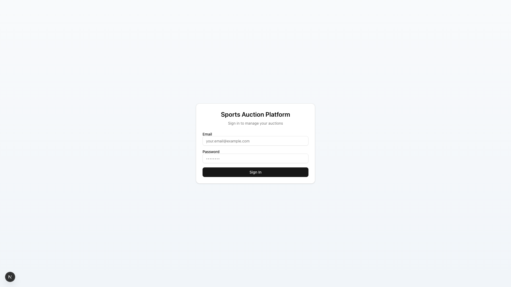

# Team Owner Quick Start Guide
## Cricket Auction Platform

---

## 1. Login (2 minutes)

**Access the Platform:**
1. Open the auction website URL provided by your admin
2. Enter your email and password
3. Click "Sign In"

*Login screen - Enter your credentials to access the platform*

**You're in!** You'll see your Team Owner Dashboard.

---

## 2. Dashboard Overview (1 minute)

**What You See:**
- **Overview Cards** at top: Your teams, players, budget, and spending
- **Team Cards** below: Each team you own with:
  - Team name and auction name
  - Status badge (look for green "LIVE" when auction is active)
  - Budget remaining (color bar: green=good, yellow=careful, red=low)
  - Player count

**Status Meanings:**
- 🟢 **IN PROGRESS (Green "LIVE")** = Auction is active, you can bid NOW!
- 🟡 **PAUSED (Yellow)** = Temporarily stopped
- 🔵 **COMPLETED (Blue)** = Auction finished
- ⚪ **NOT STARTED (Gray)** = Hasn't begun yet

---

## 3. Join Live Auction (30 seconds)

**When auction is LIVE:**
1. Look for the green "LIVE" badge on your team card
2. Click **"Join Bidding Now"** button
3. You're in the auction room!

---

## 4. Understanding the Bidding Screen (1 minute)

### Left Side - Current Player
- Player name, role, and base price
- Current highest bid
- Who's winning
- Countdown timer (if enabled)

### Right Side - Your Controls
- **Your Team Budget**: How much you have left
- **Bid Amount Box**: Your bid (with +/- buttons)
- **Quick Bid Buttons**: +1x, +2x, +3x (fast increments)
- **Place Bid Button**: Big button to submit your bid
- **Recent Bids List**: See all recent bids

### Mobile Users
- Everything scrolls normally
- **Bottom panel stays fixed** with bidding controls
- Large "Place Bid" button always accessible

---

## 5. How to Bid (1 minute)

**Simple 5 Steps:**

1. **Check the player** - Do you want them?

2. **Set your bid amount:**
   - Click **+** to increase
   - Click **-** to decrease
   - OR use **+1x, +2x, +3x** for faster jumps
   - OR type directly in the amount box

3. **Check the warnings:**
   - ⚠️ Red warnings = you can't bid (not enough budget or squad full)
   - 🟡 Yellow "Max Allowable Bid" = don't go over this amount

4. **Click "Place Bid"** - The big button shows your bid amount

5. **Done!** Your bid appears in the "Recent Bids" list instantly

---

## 6. Budget Rules (IMPORTANT!)

### The Three Numbers to Watch:

1. **Remaining Budget** (Green)
   - How much money you have left
   - Updates instantly when you win a player

2. **Maximum Allowable Bid** (Yellow/Orange box)
   - The system calculates this for you
   - Ensures you have enough left to complete your squad
   - NEVER bid above this amount

3. **Current Squad** (Blue box)
   - Shows players purchased / minimum required
   - Example: "8 / 11" means you need 3 more players minimum

### Why Can't I Bid?

**"Squad Full - Cannot Bid"**
- You've reached maximum squad size (e.g., 15 players)
- Can't buy more players

**"Cannot Afford This Player"**
- Player's base price is too high
- You need to save budget for other required players
- Skip this player

**"Bid exceeds maximum allowable amount"**
- Your bid is too high
- Lower it to the maximum shown in yellow box
- This protects you from running out of budget

---

## 7. Budget Example

**Your Situation:**
- Remaining Budget: ₹60,00,000
- Current Squad: 8 players
- Minimum Required: 11 players
- Need: 3 more players
- Minimum Price Per Player: ₹5,00,000

**System Calculation:**
- Reserve for 3 players: 3 × ₹5,00,000 = ₹15,00,000
- **Maximum You Can Bid: ₹60,00,000 - ₹15,00,000 = ₹45,00,000**

This ensures you can always complete your minimum squad!

---

## 8. Tips for Success

### Before Auction:
✅ Know minimum squad size (usually 11 players)
✅ Know maximum squad size (usually 15 players)
✅ Plan roughly which roles you need (batsmen, bowlers, all-rounders)

### During Auction:
✅ **Keep the page open** - Real-time updates need active connection
✅ **Watch the timer** - Act quickly when you want a player
✅ **Don't overspend early** - Save budget for later players
✅ **Use quick buttons** - Faster than typing
✅ **Check max allowable bid** - Always visible in yellow box

### Budget Strategy:
✅ **Don't spend it all early** - You need 11+ players minimum
✅ **Save for key players** - Budget some extra for must-have players
✅ **Watch the color bar** - Green=good, Yellow=careful, Red=risky

---

## 9. Viewing Your Team

**Anytime during or after auction:**
1. Click **"View Roster"** on your team card
2. See all your purchased players
3. Check total spent and budget remaining
4. See players grouped by role

**To return:**
- Click **"Back to Dashboard"** or
- Click **"Join Bidding"** to rejoin live auction

---

## 10. Troubleshooting

### Problem: Can't see "Join Bidding" button
**Solution:** Auction must be "IN PROGRESS" (green LIVE badge). Wait for admin to start.

### Problem: My bid was rejected
**Solutions:**
- Bid higher than current highest bid
- Check you have enough budget
- Make sure bid is below "Maximum Allowable Bid"
- Ensure squad isn't full

### Problem: Budget not updating
**Solution:** Refresh your browser (F5 or Cmd+R)

### Problem: Page frozen or slow
**Solutions:**
1. Refresh browser
2. Clear cache
3. Try different browser (Chrome recommended)
4. Check internet connection

### Problem: Not seeing other teams' bids
**Solution:**
1. Switch to another browser tab and back
2. Refresh the page
3. Check internet connection

---

## Quick Reference Card

### Bid Increment
Usually ₹50,000 per click (shown below bid box)

### Status Colors
- 🟢 **Green "LIVE"** = Auction active, bid now!
- 🟡 **Yellow** = Paused
- 🔵 **Blue** = Completed
- ⚪ **Gray** = Not started

### Budget Colors
- 🟢 **Green Bar** = >50% budget left (healthy)
- 🟡 **Yellow Bar** = 20-50% left (be careful)
- 🔴 **Red Bar** = <20% left (very low)

### Key Rules
- ✅ All bids are final
- ✅ Highest bidder wins
- ✅ Budget updates instantly
- ✅ Must complete minimum squad (usually 11)
- ✅ Cannot exceed maximum squad (usually 15)
- ✅ System protects you from overbidding

---

## Most Important Things to Remember

1. **Green "LIVE" badge** = Click "Join Bidding Now"
2. **Maximum Allowable Bid** (yellow box) = Don't go above this
3. **Keep the page open** during auction
4. **Refresh if stuck**
5. **Contact admin if you can't bid**

---

## Need Help?

**During Auction:**
Contact your auction administrator immediately via phone/WhatsApp

**Technical Issues:**
1. Try refreshing first
2. If still stuck, contact admin
3. Provide: what happened, browser used, error message

---

**That's it! You're ready to bid. Good luck!** 🏏

Remember: The system protects you from overspending. Trust the "Maximum Allowable Bid" number and you'll always be able to complete your squad.
